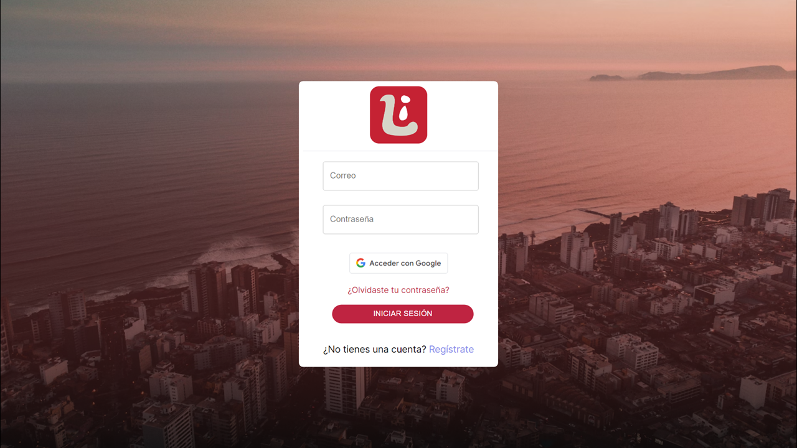
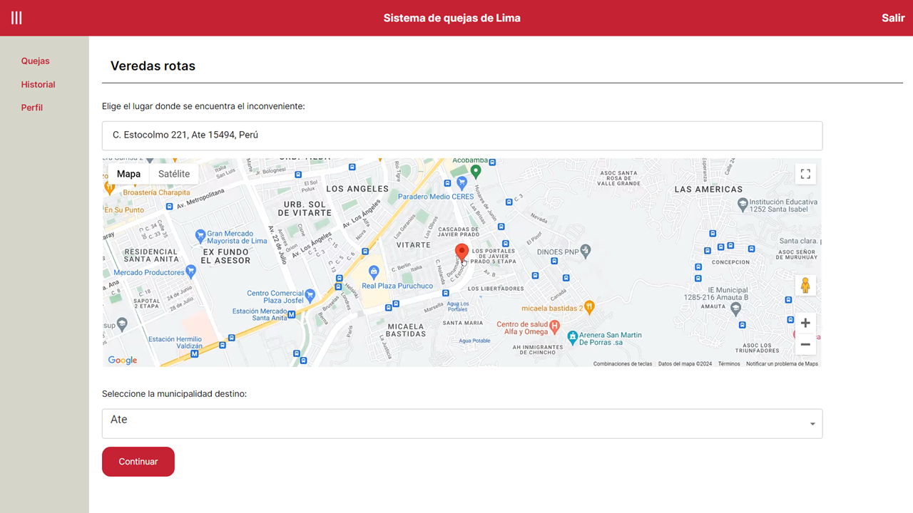
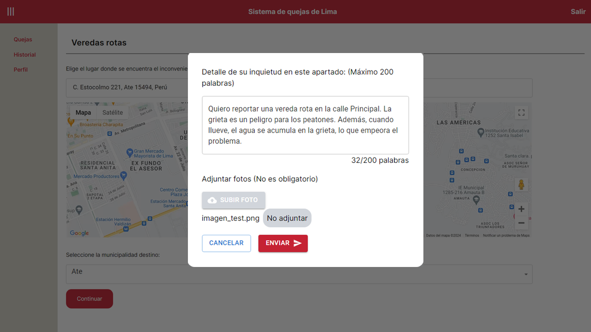
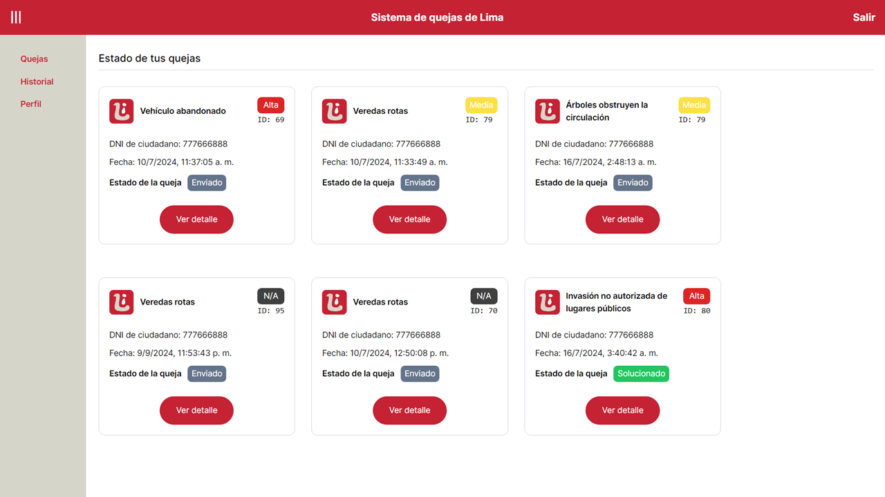
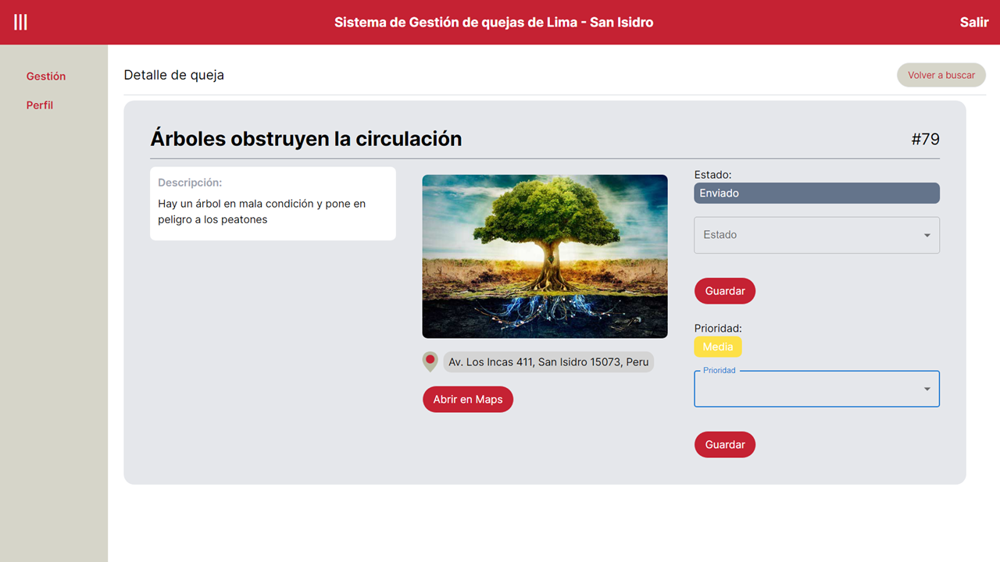

# InLima  - Aplicación de Gestión de Incidencias Ciudadanas 

## 📝 Descripción

La aplicación de **InLima** permite a los usuarios generar reportes de problemas en su entorno urbano, como incidentes, quejas y solicitudes de mejora. Los reportes incluyen descripciones detalladas, ubicaciones (gracias a la integración con la **🗺️API de Google Maps**) y la posibilidad de adjuntar fotos como evidencia. 

Los administradores pueden gestionar estos reportes, atendiendo las quejas por distrito, modificando el estado de los incidentes, y notificando automáticamente a los usuarios sobre los cambios a través de la **📧 API de Gmail**.

### ⚙️ Funcionalidades principales

- **Generación de reportes de incidencias**: Los usuarios pueden crear reportes adjuntando descripciones, ubicaciones y fotos.
- **Gestión de incidencias**: Los administradores pueden asignar y cambiar el estado de las incidencias (por ejemplo, `Pendiente`, `En proceso`, `Resuelto`).
- **Notificaciones automáticas**: Los usuarios reciben notificaciones por correo electrónico mediante la API de Gmail cada vez que su incidencia cambia de estado.
- **Autenticación con Google**: Registro e inicio de sesión con la API de autenticación de Google.
- **Rutas y sesiones protegidas**: Uso de JWT (JSON Web Tokens) para la protección de rutas y sesiones de usuario.
- **Integración con Google Maps**: Los usuarios pueden seleccionar ubicaciones exactas al generar un reporte.

## 💻 Tecnologías utilizadas

### Frontend
- **Next.js**: Framework de React para la generación de interfaces de usuario dinámicas y eficientes.
- **JavaScript**: Lenguaje de programación principal para el frontend.
- **Tailwind CSS**: Framework de CSS para el diseño de una interfaz responsiva y moderna.

### Backend
- **Node.js**: Entorno de ejecución para el servidor backend.
- **Express.js**: Framework de Node.js para la creación de la API REST.
- **PostgreSQL**: Base de datos relacional utilizada para almacenar los reportes, usuarios, y gestión de incidencias.

## 📋 Requisitos del sistema

- **Node.js**: v14 o superior
- **PostgreSQL**: v12 o superior
- **Google API Key**: Para la integración de Google Maps y autenticación con Google
- **Gmail API**: Para enviar notificaciones automáticas a los usuarios

## 🌐 Despliegue

**[InLima - Aplicación de Gestión de Incidencias](https://inlima.online)** fue alojada en **Vercel** (Frontend) y **Azure** (Backend).

> *Actualmente nuestros servidores del backend no se encuentran encendidos por falta de créditos.* 😅

## 📸 Capturas de Pantalla

> Pantalla de Login

> Creación de Quejas

> Detalle de Quejas

> Historial de Incidencias

> Gestión de Quejas por el Administrador
